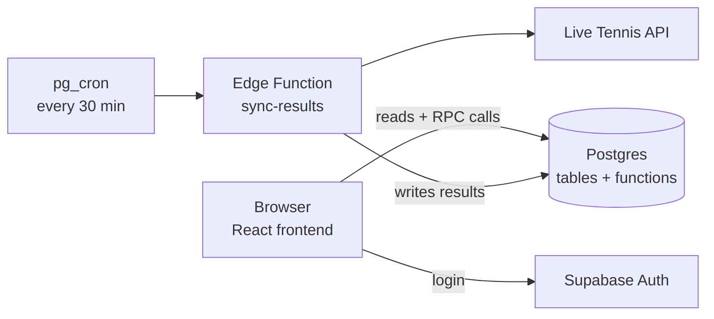
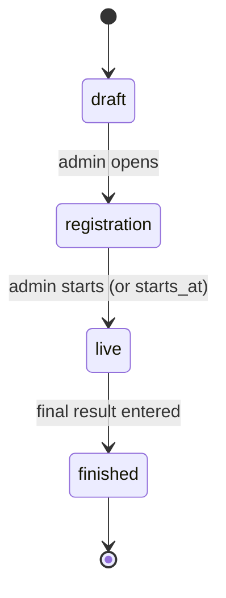

# Tennis Survivor Pool — Spec v1

25 Sept 2026 · @Robin

## Overview & goals

A web app where players join a tennis tournament pool, pick one pro player per round who must win, and survive as long as their picks keep winning. It replaces the spreadsheet + HTML demo used for the US Open 2026 pool.

**Principles:**

- Super simple v1, designed to evolve (private pools, reminders, tiebreaks later).
- One source of truth: picks + results. Survival and leaderboards are always computed, never stored or edited by hand.
- Nothing is ever deleted: eliminated players stay visible with their full pick history.
- Rules enforced in the database, not only in the UI.
- Mobile-first: most picks happen on a phone.

**Stack:** Supabase is the whole backend; the frontend is pages only.

> Note (build decision): the frontend is **React + Vite + TypeScript + shadcn/ui + Tailwind** (not Next.js as in the original brief). Env vars become `VITE_SUPABASE_URL` / `VITE_SUPABASE_ANON_KEY`.

- **Supabase** (Pro plan, one project): Auth, Postgres, security rules, 3 Postgres functions holding all game rules, one Edge Function for results.
- **Frontend:** pages only. Calls Supabase directly with the public key. No API routes, no server actions, no service key in the app.
- **Hosting:** Vercel, frontend only.

## Game rules

Each round you pick one player who must win his match; lose once and you're out.

1. **Joining:** one global pool per tournament. Anyone logged in can join while the tournament is in registration. Joining closes when the tournament goes live.
2. **One pick per round:** pick a player still in the draw. You can change it until the round's lock time.
3. **No repeats:** a player can be picked only once per entry across the whole tournament.
4. **Lock:** at `locks_at` for the round, picks freeze. Other players' picks become visible only after lock.
5. **Elimination:** you're out if your pick loses, or if you have no pick at lock.
6. **Retirement / walkover:**
   - Your player retires mid-match → loss.
   - Your player advances by walkover or opponent retirement → win.
   - Your player withdraws before playing → loss (v1, keep it simple; see Edge cases).
7. **Winners:** everyone still alive after the final is a winner. No tiebreak. If all remaining players are eliminated in the same round, they all become co-winners of that round (open question, see Edge cases).

Rounds depend on the draw size (e.g. 128 draw = 7 rounds: R1, R2, R3, R16, QF, SF, F).

## Roles & permissions

Two roles: **player** (default for every account) and **admin** (one person, set by hand in the database).

| Action | Player | Admin |
|---|---|---|
| Sign up / log in | Yes | Yes |
| See tournaments, draws, leaderboards | Yes | Yes |
| Join a tournament (registration only) | Yes | Yes |
| Create / change own pick before lock | Yes | Yes |
| See others' picks | After lock | Always |
| Create / edit tournaments, rounds, draw | No | Yes |
| Enter or correct results | No | Yes |
| Change tournament status | No | Yes |
| Remove an entry, fix a pick on someone's behalf | No | Yes (logged) |

**Auth:** Supabase Auth with email magic link (+ Google optional). Each user picks a unique public username on first login.

## Tournament lifecycle

A tournament moves through four statuses, changed by the admin.

| Status | Visible to players | Join | Pick |
|---|---|---|---|
| draft | No | No | No |
| registration | Yes | Yes | Round 1 only |
| live | Yes | No | Current round, until lock |
| finished | Yes | No | No |

Round 1 picks open during registration so people can pick as soon as they join. The current round is the first round whose `locks_at` is in the future.

## Player screens & flows

Five screens cover the whole player experience.

1. **Login:** email login only. First login asks for a username, tennis ranking, region, city, country (France preselected).
2. **Tournaments list:** open (joinable), live, finished. Each card shows status, dates, entrants, and "Joined / Alive / Out" for me.
3. **Tournament page**, three tabs:
   - **My pick**
     - Current round, lock countdown in local time.
     - List of players still in the draw. Already-used players and players who already lost are greyed out with the reason.
     - Selected pick highlighted; change allowed until lock.
     - My trail: one chip per round (won / lost / pending / missing).
     - Banner if no pick yet for the current round.
   - **Pool leaderboard**
     - Header: alive / total, survivors per round (the funnel from the demo).
     - Rows: rank, username, pick trail, status tag (Alive, Out · round).
     - Sort: alive first, then rounds survived, then name.
     - Search by username or player; tap a row to highlight it.
     - Grid view (users × rounds) and pick distribution per round, both only for locked rounds.
   - **Draw**
     - Per round, the players still in: advanced in green, lost struck through, not played yet neutral.
     - Optional later: a "live" dot on players currently on court.
4. **Join:** one button on the tournament page while in registration. Joining creates the entry.
5. **Profile:** username, my tournaments history.

## Admin screens & flows

The admin sets up a tournament once, then only confirms results round by round.

1. **Create tournament:** name, tour (ATP/WTA), draw size, starts_at, optional external API id. Rounds are generated from the draw size (names editable).
2. **Rounds:** set `locks_at` per round (default: first scheduled match of that round). Editable until the round locks.
3. **Draw import:** paste a CSV (name, seed, external_id) or import from the API. Players can be added or removed until the tournament goes live (qualifiers, lucky losers).
4. **Results:** one card per round listing the players still in. Tap to mark each as advanced or lost. API sync pre-fills these; the admin can override any value.
5. **Corrections:** changing a past result instantly recomputes every entry (the demo's "uncheck and everything recolors").
6. **Status:** buttons to move draft → registration → live → finished.
7. **Entries:** list of entrants; remove an entry or set a pick on someone's behalf. Every admin write is recorded in an audit log.
8. **Sync panel:** last API sync time, errors, unmatched player names, "Sync now" button.

## Data model

Nine tables (including `profiles_private`) and one view. Survival is never stored: it is derived from picks and results.

| Table | Key columns | Notes |
|---|---|---|
| profiles | id (= auth.users.id), username unique, is_admin bool | Created on first login; personal fields in profiles_private (owner-only) |
| tournaments | id, name, tour, draw_size, status enum, starts_at, external_id | status: draft, registration, live, finished |
| rounds | id, tournament_id, idx (1..n), name, locks_at | unique(tournament_id, idx) |
| players | id, tournament_id, name, seed, external_id, country (FRA, GER…), ranking | The draw; country + ranking set by the API import |
| matches | id, tournament_id, round_id, external_id, player1_id, player2_id, winner_id, scheduled_at, score, status (scheduled, live, done), position | One row per bracket slot, API only. position 1 = top; slot p of round k+1 is fed by slots 2p-1 and 2p of round k |
| player_results | player_id, round_id, result (won, lost), status (scheduled, live, done), source (manual, api), updated_at | PK(player_id, round_id); status optional, for the live dot |
| entries | id, tournament_id, user_id, joined_at | unique(tournament_id, user_id) |
| picks | entry_id, round_id, player_id, updated_at | unique(entry_id, round_id), unique(entry_id, player_id) |
| admin_log | id, admin_id, action, payload jsonb, at | Audit trail |

**View `entry_status`** (one row per entry):

- For each locked round in order: pick missing → out at that round; pick lost → out at that round; pick won → continue; result not in yet → pending.
- Columns: entry_id, alive bool, eliminated_round, rounds_survived.
- The leaderboard, funnel and pick distribution all read from this view.

A `player_status` helper (player's last round and whether he lost) drives which players are pickable and the Draw tab.

## Security

All rules live in the database. The browser can read public data and call 3 functions; it cannot write to any table directly.

### Postgres functions (the only way to write)

| Function | Who | Checks |
|---|---|---|
| join_tournament(tournament_id) | Logged-in user | Tournament in registration, not already joined |
| make_pick(round_id, player_id) | Logged-in user | Own entry, entry alive, now() < locks_at (database clock), player in this tournament and not out, player not already used |
| set_result(player_id, round_id, result) | Admin only | is_admin(); writes to admin_log |

### Tables

- Security rules (RLS) on every table; no insert/update/delete policies for users.
- Public read: tournaments (not draft), rounds, players, player_results, profiles.username.
- Private: personal fields (email, ranking, region, city, country) in a separate `profiles_private` table, readable only by their owner.
- Picks read: own picks always; others only once `locks_at <= now()`; admin always.
- Backup constraints: unique(entry_id, round_id) and unique(entry_id, player_id).
- Admin: `profiles.is_admin`, checked by an `is_admin()` SQL function. Admin setup screens (tournament, rounds, draw) use admin-only write policies.
- Tennis API key stored in Supabase secrets, used only by the Edge Function.
- Run the Supabase security advisor after each schema change.

### Privacy (EU)

- Short privacy notice at signup listing what is collected (email, ranking, region, city, country) and why.
- Users can delete their account: personal data erased, entries kept as "deleted user".

## Results source & API sync

The app only needs who advanced each round — no scores, sets or live feed. Manual entry works on day one; an API fills the same table later.

### Flow

1. pg_cron calls the Edge Function `sync-results` every 30 min while a tournament is live.
2. The function fetches the singles draw for the tournament's `external_id` (`{tour}/tournament/{id}/{year}/draws`, 1 call: every main-round match with bracket slot, score, player country). It upserts `matches`. Fallback when the draw is empty or fails: `{tour}/tournament/results/{id}`. The draw import also calls `{tour}/ranking/singles?pageSize=500` once for `players.ranking`.
3. Map both players by `players.external_id` (fallback: normalized name; unmatched names go to the admin sync panel).
4. Upsert `player_results` (won / lost, source = api). Never overwrite a row the admin set manually.
5. Optional: write status = live for matches in progress (live dot).

Cost: ~1,500 invocations/month, inside the Pro plan's 2 million included.

### Free API candidates (to test on a real Grand Slam before choosing)

| Option | Free tier | Fit | Risk |
|---|---|---|---|
| Live Tennis API | 100 requests/day, 30/min, no card | Fixtures, players, match status | Check that round names and Slam draws are included |

Budget check: 30-min polling over 18 h = 36 calls/day, within a 100/day quota.

Sources: pages above, checked 2026-09-25.

## Edge cases

| Case | v1 behaviour |
|---|---|
| No pick at lock | Out at that round |
| Picked player retires mid-match | Lost → out |
| Picked player wins by walkover or opponent retires | Won |
| Picked player withdraws before his match (lucky loser comes in) | Lost → out. Admin adds the lucky loser to players |
| Matches of a round span several days | One lock per round, at the first match of the round |
| Player plays before the round lock (schedule change) | Admin moves locks_at earlier; picks of that player after his match starts are rejected only by lock time, so keep locks conservative |
| No pickable player left (all remaining players already used) | Out at that round (same as no pick) |
| Admin corrects a past result | Everything recomputes; eliminated users can come back to life |
| Round result incomplete | Entries picking unfinished players stay pending; the next round's lock still applies |
| All remaining entries eliminated in the same round | Open question: they all become co-winners, or nobody wins |
| Rain delays push matches past the next lock | Open question: admin extends the next locks_at, or allow picking pending players at risk |
| User deletes account | Entry kept, username shown as "deleted user" |

## Out of scope / later

The v1 schema already leaves room for each of these without a migration of existing data.

- Private pools with an invite code (add pools table; entries.pool_id).
- Email reminders before each lock (Edge Function + email).
- Tiebreaks (e.g. "audace" score from the demo, or final score prediction).
- Auto-pick instead of elimination on a missing pick.
- Live dot on picked players (player_results.status).
- Scores, sets, full bracket drawing.
- Multiple admins or per-tournament admins.
- Push notifications / PWA install.

## Milestones

1. **M1 — Backend:** Supabase project, schema, entry_status view, RLS + the 3 game functions, seed data from the US Open 2026 demo to test.
2. **M2 — Player app:** login, tournaments list, join, My pick, Pool leaderboard, Draw tab.
3. **M3 — Admin:** create tournament, rounds and locks, CSV draw import, results entry and corrections, status changes, audit log.
4. **M4 — API sync:** test the three candidates on a live tournament, pick one, sync-results Edge Function on pg_cron, sync panel.
5. **M5 — Polish:** grid view, pick distribution, funnel, mobile pass.

## Open questions

- [ ] All remaining entries lose in the same round: co-winners or nobody?
- [ ] Rain delays past the next lock: extend the lock by hand, or let people pick unfinished players?
- [ ] Which API after testing?

## Build & deployment

One Supabase project, one repo, one Vercel project.

### Build (Claude Code)

1. Connect the Supabase MCP in Claude Code, scoped to the project (project_ref). Keep tool approval on.
2. Claude Code creates tables, security rules and the 3 functions through the MCP, then runs the security advisor.
3. Claude Code deploys the sync-results Edge Function and schedules it with pg_cron; the tennis API key goes in Supabase secrets.
4. Claude Code builds the React + Vite frontend, calling Supabase directly.

### Deploy (Vercel)

1. Push the repo to GitHub.
2. Vercel → Add New → Project → import the repo (Vite detected automatically).
3. Add 2 environment variables: `VITE_SUPABASE_URL`, `VITE_SUPABASE_ANON_KEY`.
4. Deploy.
5. Supabase → Auth → URL Configuration: set the Site URL to the Vercel URL.

Every push to main redeploys.
